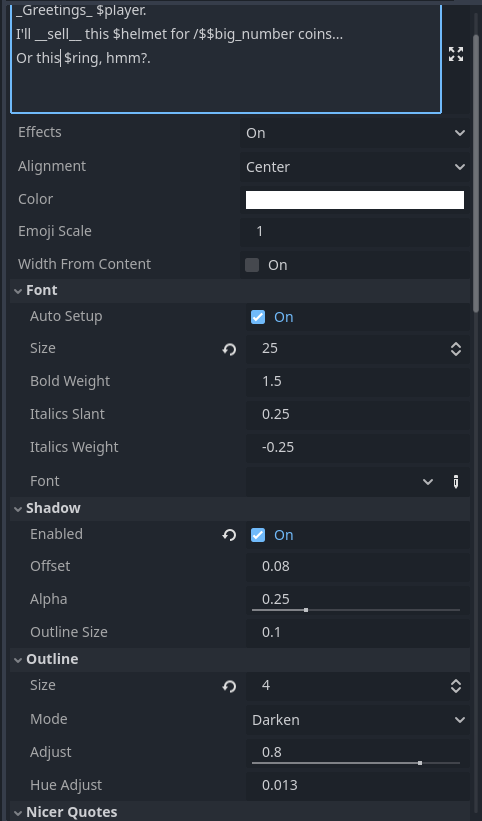

# RichTextLabel2 - CN
官方`RichTextLabel`关于BBCode的使用地址：https://docs.godotengine.org/zh-cn/4.x/tutorials/ui/bbcode_in_richtextlabel.html

演示见Demo。

两个节点：
- `RicherTextLabel`：简化显示状态数据和样式化文本的工作。
- `RichTextAnimation`：用于对话和电影场景，负责文本的进出动画。

| | |
|-|-|
|||
|||
|||


https://github.com/user-attachments/assets/8e0f30b5-2483-4280-b904-8ec1898f72c2

https://github.com/user-attachments/assets/caf703ad-44d3-43b0-b4f9-56f513ac572f

# 功能
- 支持多种 bbcode 标签 + 易于关闭 + 自动为名称上色：`[deep_sky_blue;b]Bold blue[] and [orange;i]Italic orange[].`
- 整数标签用于绝对字体大小，浮点数标签用于相对字体大小：`[32]Big text[] and [0.5]half text.[]`
- 自动表情符号：`I'm :smile: with results. You get a :+1:.`
- 使用到效果时会自动安装效果：`We on the [sin]sinewave[] vibe.`
    - 提供许多预置效果。见下方“标签”部分。
- 上下文字符串：`Only $coins coins, $player.name? Travel to $location.get_name("west") for more coins.`
    - 可以调用函数或获取嵌套属性。
    - 会对整数美化加千位分隔符。`1234 -> 1,234`
    - 如果对象实现了 `to_rich_string()`，会用它来美化对象。
    - 如果是数组，会把数组项以逗号连接成列表。
- 简易字体选择下拉，自动检测项目中所有字体。
    - 如果缺少 Bold / Italic /BoldItalic 变体，会自动生成。
    - 可调节加粗程度和斜体倾斜度。
- 自动打开和闭合引号。
- 自定义 Markdown 如何被转换：`_italic_ -> [i]%s[] -> [i]italic[] -> [i]italic[]` `*cough* -> [i]*%s*[] -> [i]*cough*[]`。
- 自动颜色格式化：`"My [%s]colored string[] is easy." % [Color.DEEP_SKY_BLUE]`
- `RichTextAnimation` 用于淡入淡出动画。
    - 包含 7 种转场效果。（有些不稳定/未经充分测试。）
    - Click2Continue 节点可以在最后可见字符处显示。
    - `[hold] [h]` 标签可暂停动画直到用户继续。`Wait...[h] Did you hear...[h] *Bang*!`
    - `[wait] [w]` 标签可按秒数等待（默认 1 秒）`Let me thing.[w] Hmm...[w]...[w]...`
    - `[pace] [p]` 设置动画速度。`A slow talker [p=.1]talks like this...[p] While fast talkers [p=3]talk like this...`
- 还有很多我记不得的功能……功能非常丰富。

> [!NOTE]
> 你需要在项目中创建一个 `FontHelper`。
> 然后按下 `Update` 按钮来更新字体列表。
> 之后你就可以在 `RicherTextLabel` 的下拉中选择字体了。




# 标签

|Tag|说明|示例|
|:-:|-----------|:--:|
|`@` `meta`|在按下时在上下文节点上执行表达式。<br>如果以 `https://` 开头则会在浏览器中打开。|`[@print("Hey!")]`|
|`^` `hint`|作为提示弹窗显示的表达式。|`[^sword.get_hover_text()]`|
|`!`|图片 id。不需要扩展名。|`My icon: [!icon]`|
|`dim`|将颜色加深 33%。||
|`lit`|将颜色变亮 33%。||
|`hue`|转换色相。0 或 1 = 无变化。0.5 = 色相对立。|`[hue 0.25]`|
|`beat`|来回脉动字体大小和颜色。||
|`curspull`|根据鼠标/光标位置牵引，`pull`属性为 `1` 则被鼠标吸引，为 `-1` 则远离鼠标。|`[curspull pull=-1]`|
|`cursup`|光标悬停时字符会变大，`scale` 属性控制变大的程度。|`[cursup scale=1.5 radius=48.0]`|
|`curscolor`|光标悬停时字符会变色，`intensity` 属性是变色的不透明度，值为`1.0`则完全不透明。|`[curscolor color=gold radius=48.0 intensity=1.0]`|
|`cuss`|动画替换元音为符号（规避脏话）。|`What the [cuss=red]heck[].`|
|`heart`|爱心弹跳动画。演示如何更改字体并使用 emoji。||
|`jit`|抖动动画，以字符或以单词为单位抖动，`word` 为`true` 则以单词为单位，`splitters` 属性可用于自定义所有单词分隔符|`[jit scale=1.5 freq=1.8 word=false splitters= ,.!?-]{text}[]`|
|`jump`|跳动动画，以字符或以单词为单位跳动，`word` 为 `true `则以单次为单位，`splitters` 属性可用于自定义所有单词分隔符，跳动角度属性为`angle`，`speed` 属性控制跳动频率。|`[jump scale=1.0 angle=0 speed=6.0 word=false splitters=,.!?-]{text}[]`|
|`l33t`|将字母替换为数字的效果（1337 风格）。||
|`off`|忽略（偏移）。||
|`rain`|模拟下雨效果。用途未知。||
|`secret`|当鼠标靠近时才可见。||
|`sin`|可能不再需要因为 sin 已内置？||
|`sparkle`|对字符颜色进行闪光动画。通常与颜色标签配合使用。||
|`sway`|左右倾斜摇摆效果。||
|`uwu`|把所有 R 和 L 转成 W（萌化风格）。||
|`wack`|随机旋转与缩放创造夸张效果。||
|`woo`|在大小写间切换，制造讽刺语气。||
|`ghost`|使用了sin轨迹的渐隐，营造闪烁效果|[ghost freq=5.0 span=10.0 intensity=1.0]|
|`matrix`|一串乱码滑动最后显示字符，用途未知。|[matrix clean=2.0 dirty=1.0 span=50.0]|
|`glitch`|字符闪烁出现乱码，营造故障效果|[glitch intensity=1.0 freq=6.0]|
|`pulse`|[内置效果](https://docs.godotengine.org/zh-cn/4.x/tutorials/ui/bbcode_in_richtextlabel.html#pulse)：pulse 使每个字符的不透明度和颜色倍增。它可用于吸引用户对特定文本的注意力。||
|`wave`|[内置效果](https://docs.godotengine.org/zh-cn/4.x/tutorials/ui/bbcode_in_richtextlabel.html#wave)：wave 使文本上下移动。||
|`tornado`|[内置效果](https://docs.godotengine.org/zh-cn/4.x/tutorials/ui/bbcode_in_richtextlabel.html#tornado)：tornado 使文本绕圈移动。||
|`shake`|[内置效果](https://docs.godotengine.org/zh-cn/4.x/tutorials/ui/bbcode_in_richtextlabel.html#shake)：shake 会使文本摇晃。||
|`fade`|[内置效果](https://docs.godotengine.org/zh-cn/4.x/tutorials/ui/bbcode_in_richtextlabel.html#fade)：fade 会创建一个静态淡入淡出效果，使每个字符的不透明度成倍增加。||
|`rainbow`|[内置效果](https://docs.godotengine.org/zh-cn/4.x/tutorials/ui/bbcode_in_richtextlabel.html#rainbow)：rainbow 赋予文本随时间变化的彩虹颜色。||


## 颜色
有多种颜色标签模式。
|模式|说明|示例|
|-------|-----------|-------|
|`[red]`|任何内置颜色名称均可作为标签。|`[red]Red text.[]`|
|`[0xff0000]`|十六进制颜色代码会被转换为对应颜色。|`[0xff0000]Red text.[]`|
|`[(1.0, 0.0, 0.0)]`|括号内的浮点数。适合与字符串格式化配合使用。|`"[%s]Red text.[][%s] Blue text.[]" % [Color.RED, Color(0.0, 0.2, 1.0)]`|

你可以在 `ProjectSettings` 中重写颜色，键为标签名，值为要替换成的颜色，路径为 `"richer_text_label/colors"`。

# RichTextAnimation

此节点用于对话系统与过场动画场景。

## 动画标签

|Tag|说明|参数|示例|是否自闭合|
|:-:|-----------|---------|:-----:|:----------:|
|`wait` 或 `w`|等待若干秒。|秒数。|`Wait...[w=2] Did you hear...[w] *bang*`|✅|
|`hold` 或 `h`|暂停，直到调用 `advance()`。|`[h]`||✅|
|`pace` 或 `p`|设置动画速度。|缩放系数。|`[p=2.0]Fast talker.[p=0.2]Slow talker.[p]Normal speed.`|✅|
|`skip`|在选中项之间跳过动画。||`They call it [skip]The Neverending Forest[].`|❌|
|`$`|在动画达到此位置时运行一个表达式。|表达式。|`Did you hear something...[$play_sound("gurgle")]`|✅|
|`#`|到达时调用 `on_bookmark.emit()` 并传入 id。|书签 id。|`He told me [#quote]the haunted forest[#endquote] wasn't so haunted.[#end]`|✅|

## 动画类型

|标签|说明|参数|
|:-:|-----------|---------|
|`back`|字符反弹进场。||
|`console`|（有问题）模拟电脑终端效果。||
|`fader`|字符透明度淡入。||
|`fallin`|字符从较大尺寸缩放进入。||
|`focus`|字符从随机方向滑入。||
|`fromcursor`|字符从光标位置滑入。||
|`growin`|字符从极小缩放到正常大小。||
|`offin`|字符从左侧略微偏移处滑入。||
|`prickle`|字符透明度淡入并伴随随机偏移。需要较低的 `fade_in_speed` 才好看。||
|`redact`|（有问题）模拟被遮掩文本暴露的过程。||
|`wfc`|字符最初为随机的 0/1，然后逐渐“塌缩”为正确字符。||

如果 `shortcut_expression = true`，你可以使用 `<code expression>` 形式代替 `[!code expression]`。
```
Did you hear something...[wait][$play_sound("gurgle")] Uh oh![$player.fear = 100.0] Ahh...
Did you hear something...[wait]<play_sound("gurgle")> Uh oh!<player.fear = 100.0> Ahh...
```

如果 `shortcut_bookmark = true`，你可以使用 `#bookmark` 形式代替 `[#bookmark]`。
```
He told me#quote the haunted forest#endquote wasn't so haunted.#end
He told me[#quote] the haunted forest[#endquote] wasn't so haunted.[#end]
```

# 字体
启用插件时，它会扫描项目文件系统中的字体，并把它们添加到 `richer_text_label/fonts`，随后可在 `RicherTextLabel` 的下拉中访问。

# Emoji 字体
如果字体名称中包含 "emoji"（不区分大小写），则该字体会被用作 emoji，而不是默认字体。

有时 emoji 在某些电脑上会造成卡顿，为解决这个问题，插件会创建一个自定义的 FontVariant，以 emoji 字体为 base，同时将 `ThemeDB.fallback_font` 作为回退字体。这通常能避免卡顿。

如果使用了 emoji 标签 `:smile:` 或 `[:smile:]`，会创建 `emoji_font` 的元数据键并记录使用的字体。

# 管道（Pipes）
管道符 `|` 用于对字符串做后处理。

有两种用法：
- 在表达式内部：`{$score+2|pipe}`
- 或作为标签：`[|pipe]Text to be passed.[]`

```gd
# 这些用法效果相同。
"We'll visit {location|capitalize} tomorrow."
"We'll visit {location.capitalize()} tomorrow."
"We'll visit [|capitalize]$location[] tomorrow."

# 也可以传参数（以空格分隔）:
"Day of week: {time.day_of_week|substr 0 3}"
"Day of week: {time.day_of_week.substr(0, 3)}"
"Day of week: [|substr 0 3]$time.day_of_week[]"
```

真正强大的地方在于你可以添加自定义管道（pipe）。管道会尝试在上下文节点中调用一个方法。
```gd
func cap(x):
    return x.capitalize()

func oooify(x):
    if cow_mode == CowMode.ACTIVATED:
        return x.replace("o", "[sin]ooo[/sin]").replace("O", "[sin]OOO[/sin]")
    else:
        return x

# 管道可以链式调用。
# Location 名称先被 capitalize，然后把所有 O 拉长。
"We'll visit {location|cap|ooify}."

# 或者根据上下文数据改变整段对话样式。
[|ooify]Wow those cows were mooing.[]
```

或者你想基于角色的情绪来美化文本：
```gd
func mood(s: String, npc_id: String):
    match npcs[npc_id].emotion:
        Emotion.HAPPY: return "[color=yellow]%s[/color]" % s
        Emotion.SAD: return "[color=aqua]%s[/color]" % s
        Emotion.ANGRY: return "[color=red]%s[/color]" % s
        _: return s

"Mary: [i;|mood mary]What I'm saying will be colored based on my mood.[]"
"John: [i;|mood john]What I'm saying will be colored based on my mood.[]"
```

> [!NOTE]
> `[|pipe]` 标签函数必须返回“旧式”的 BBCode（old fashioned BBCode）。
> 它不支持类似 Markdown 风格的标签功能（如自动替换）。未来可能会修复。


# 更新日志（Changes）
- 1.16 Edit by Cauchyoooo.
    - 将 `[jit]` 和 `[jit2]` 整合为 `[jit]`，通过 `word` 属性可以选择以单词或字符为单位，增加 `splitters` 属性自定义单词分隔符。
    - 将 `[jump]` 和 `[jump2]` 整合为 `[jump]`，增加的 `word`属性和`splitters` 属性功能同上。
    - 新增效果 `[cursup]` ，鼠标悬停在文字上方时，字体会变大。
    - 新增效果 `[curscolor]`，鼠标悬停在文字上方时，字体会变色。
    - 新增效果 `[ghost]`，官方示例效果，像幽灵一样按一定频率略过文字，文字被略过时有隐藏效果。
    - 新增效果 `[matrix]`，官方示例效果，一段乱码从右往左滚动，最后显示正文。
    - 新增效果 `[glitch]`，字符闪烁乱码效果。
    - 新增中文文档，英文文档暂未同步。
- 1.15
    - 允许以 "." 开头的浮点数：`Normal [.5]half size[]`
    - 实现了 `effect_weight`，用于对效果的开关做插值。
        - `[sin]` 效果会缩放。
        - `[jit]` `[jit2]` 效果的抖动程度可调。
        - `[jump]` `[jump2]` 跳跃幅度可调。
        - `[rain]` 可调节色彩与运动。
        - `[sparkle]` 可调节色相与明度的调整比例。
        - `[sway]` 可调节摆动幅度。
        - `[wack]` 可调节缩放量。
    - 为 `[jump]` 和 `[jump2]` 添加了 `speed` 属性。
    - 改进了 `[cuss]`，现在只屏蔽元音。
    - 调整 `[sway]` 更随机化。
    - 修改 `[wack]` 只改变缩放。
    - `[cuss]` 不再改变字体颜色，除非显式指定 `[cuss=red]`。
    - 图片标签现在支持以 `res://` 或 `user://` 开头的路径：`[!user://myimage]`
    - 添加 `ProjectSettings` 键 `richer_text_label/user_effects_dir`，用于自定义效果目录。
    - 重写了一些 `RichTextEffectBase` 代码以便更易于扩展。
    - 若 Godot >=4.4，`context_state` 会自动把键转换为 `StringName`。
- 1.14
    - 若使用 Godot v4.4+，ProjectSettings 中的 `color` 覆盖将变为类型化字典。
    - 允许在 ProjectSettings 的 `color` 覆盖中直接使用 `Color` 类型。
- 1.13
    - 对 `FontHelper` 做了重大变更，现在启用插件时会把字体列表写入 ProjectSettings。
    - 把颜色标签的覆盖从配置文件移动到 ProjectSettings。
- 1.12
    - 添加十六进制颜色标签模式：`[0xff0000]red[]`。
    - 添加通过 `res://richtext_tags.cfg` 覆盖颜色和自定义标签的能力。
    - 更新 README 以说明 `res://richtext_tags.cfg`。
    - 修复括号颜色模式未使用 alpha 通道的问题。
    - 修复括号颜色模式在只给出 RGB 时出错的问题。
- 1.11
    - 删除了 Godot 4.4 中的 `export_tool_button` 在 `FontHelper` 中的使用。
    - **破坏性变更：** Godot 4.4 添加了 `is_finished()`，与本资源冲突，因此改名如下：
        - `is_finished()` -> `is_anim_finished()`
        - `is_holding()` -> `is_anim_holding()`
        - `is_waiting()` -> `is_anim_waiting()`
        - `finish()` -> `finish_anim()`
- 1.10
    - **破坏性变更：** 把 meta 符号改为 `@`，而不是 `!`。
    - 添加 `[!image]` 标签用于插入图片。
    - 修复导出项目中字体被重置的问题。
    - 把 `FontHelper` 改为一个你需要创建的资源。
    - 去掉了对 4.4 开发版的 `fit_width` 引用。
- 1.9
    - 添加一个优化以改善编辑器实例化速度（通过在 `show_properties = false` 时禁用 `_get_property_list()`）。
    - 缓存正则表达式模式。
    - 移除了 `fit_width` 与 `fit_width_buffer`，因为 `fit_content` 在 `autowrap_mode = off` 时可替代。
- 1.8
    - 修复对内置效果的支持：`pulse` `wave` `tornado` `shake` `fade` `rainbow`
    - 移除 Godot 4.4.dev 的 `PROPERTY_HINT_DICTIONARY_TYPE`。
- 1.7.1
    - 修复 `FontHelper` 在打包后出错的问题。
- 1.7
    - 将 `set_bbcode` 改为在帧末队列执行。
    - 把标签状态与栈移入 `STACK_STATE` 对象。
    - 把 `font_cache` 与字体相关函数移到 `FontHelper`。
    - 移除了 `_random` 并把它设为 meta 属性，因为很少使用。
- 1.6.3
    - 修复 `color` 属性无法通过脚本设置的问题。
    - 修复对齐错误并使用稍微高效的方法。
- 1.6.2
    - 移除 Godot 4.4.dev 的 `horizontal_alignment` 属性。
- 1.6.1
    - 移除 Godot 4.4.dev 的显式类型字典特性。
- 1.6
    - 添加 `outline_color` 用于设置默认描边颜色。
    - 添加描边模式：
        - `CUSTOM` 将默认 `outline_color` 应用到所有文本。
        - `CUSTOM_DARKEN` 将默认描边应用到未着色文本，已着色文本会变暗描边。
        - `CUSTOM_LIGHTEN` 将默认描边应用到未着色文本，已着色文本会变亮描边。
    - 将 `OutlineStyle` 重命名为 `OutlineMode` 以匹配属性 `outline_mode`。
    - 修复 `OutlineMode.OFF` 未能关闭描边的问题。
- 1.5
    - 添加 `[!]` meta 标签，在点击时调用表达式。
    - 添加 `[^]` 提示标签，在悬停时显示表达式作为提示信息。
    - 为 `hint` 标签添加自定义工具提示，使用 `RicherTextLabel` 显示。
    - 添加 `meta_auto_https`，用于自动在浏览器中打开 URL。
    - 添加 `fit_width`，会把 `custom_minimum_size.x` 设为 `get_content_width()`。
    - 改善对 `\n` 的处理。移除了 `alignment`（因为原生 `RichTextLabel` 现在有 `horizontal_alignment`）。
- 1.4.2
    - 修复自定义 `RichTextEffects` 在打包项目中不起作用的问题。
- 1.4.1
    - 修复变量无法重置为默认值的问题。
- 1.4
    - 调整当节点尚未进入树时的 bbcode 初始化方式。
    - 通过把所有 `@export` 移到 `_get_property_list` 来稍微加快节点选择速度。
    - 通过缓存项目字体来稍微加快节点选择速度。
    - 把脚本名改为小写以匹配 Godot 推荐风格。
    - 把 `context_nice_*` 属性名改为 `context_rich_*`。
- 1.3 **破坏性变更**
    - 类名 `RicherTextLabel` 从 `RichTextLabel2` 改名为 `RicherTextLabel`。
    - 对象可以实现 `to_rich_string()` 代替旧的 `to_string_nice()`。
    - `advance()` 现在只跳过下一个 `[wait]` `[hold]` 或 `[$expression]`，而不是所有触发器。
    - `advance()` 在仍在播放时返回 true。
    - 强制完成时增加小等待，避免用户误跳过文本。
    - 修复了自动保存字体到磁盘导致场景尺寸过大的问题。
    - 修复 `fit_content` 的问题，现在 `override_fitContent` 确实会强制 `custom_minimum_size`。
    - 修复基于光标的效果很卡的问题。
    - 修复 ctc_position 在换行时的行为。
    - 修复动画在接近完成时的跳动问题。
    - 修复 `set_bbcode` 被多次调用的问题。
- 1.2
    - 添加管道（`|`），详见 README。
    - 对小数数字的自动样式化：
        - `autostyle_numbers_pad_decimals` 是否启用？
        - `autostyle_numbers_decimals` 小数位数。
    - 添加 4 个新效果：
        - `[curspull]` 演示基于光标位置的动画。
        - `[wack]` 随机缩放与旋转。
        - `[beat]` 每秒脉动 scale 与 color。
        - `[secret]` 在鼠标靠近时才显示字符。
    - 动画方面新增 3 种：
        - `[fromcursor]` 字符从光标位置进出。
        - `[growin]` 字符先从很小放大，超调后回到正常大小。
        - `[offin]` 字符从左侧微偏移处进场。
    - 调整了 `[cuss]` `[heart]` `[rain]` `[sway]` `[uwu]` 的行为。
    - 修复了围绕标签的 Markdown 检测问题。
- 1.1
    - 添加 `context_state: Dictionary` 用于传入额外参数以供表达式使用。
    - 添加 `{}` 模式以包含复杂表达式。例如：`{lerp(score, 2, 0.2) * PI}`。
    - 添加 `autostyle_emojis` 选项以禁用 emoji 检测。
    - 修复 `emoji_font` 未加载的问题。
    - 修复 `emoji_scale` 未生效的问题。
    - 修复在使用 emoji 后效果不再动画的问题。
    - 修复自定义效果的文本元数据问题。
    - 修复当标签周围有 Markdown 符号时的检测问题。
    - 添加了许多注释。
    - 动画：
        - 添加 `ctc_offset`。
        - 添加 `ctc_on_wait` 控制在等待计时时 ctc 是否可见。
        - 添加 `ctc_on_finish` 控制在动画完成时 ctc 是否可见。
        - 添加 `default_wait_time` 用于 `[wait]` 与 `[w]` 标签的默认时间。
        - 添加等待/暂停开始与结束的信号（signals）。
        - 添加 `signal_quotes` 与 *quote* 开始/结束信号。
        - 添加 `signal_stars` 与 *stars* 开始/结束信号。
        - 修复表达式触发器、书签触发器。
        - 修复 `[wait][w][hold][h][pace][p][skip]` 标签。
        - 修复 ctc 正常显示。
        - 重命名了一些信号以使其语义更清晰。
